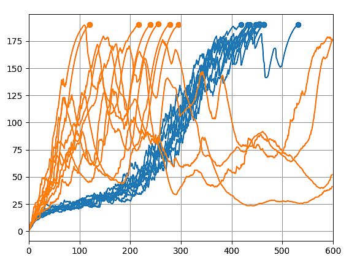

# Apprentissage par renforcement
## Méthode 'acteur'

La vidéo de ce tutoriel est disponible à l'adresse suivante: 
https://www.youtube.com/watch?v=LtRAgxRb5eQ

Ci dessous, le graph de l'apprentissage sur l'environnement CartPole (https://gym.openai.com/envs/CartPole-v0/) 
En bleu: Méthode 'critique' 
En orange: Méthode 'acteur' 

